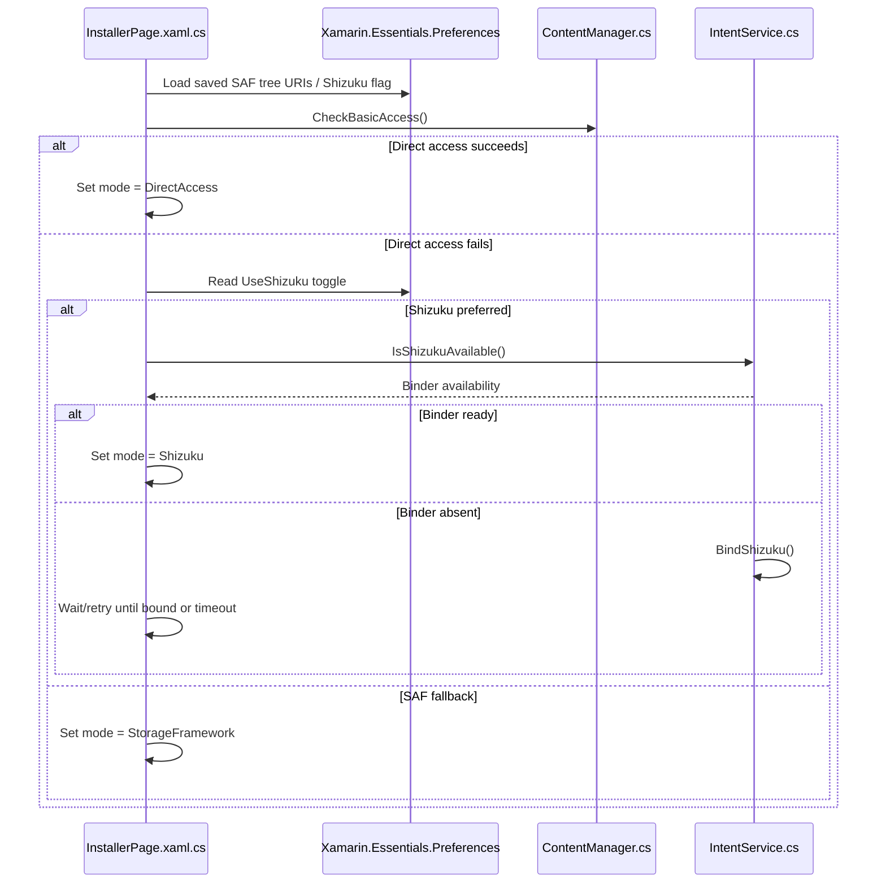
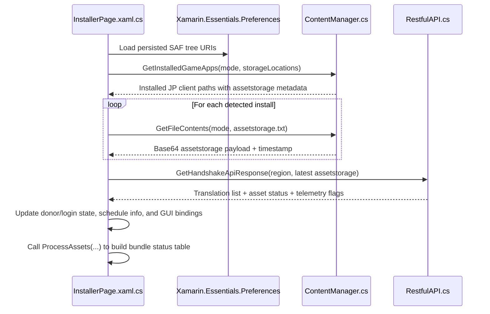
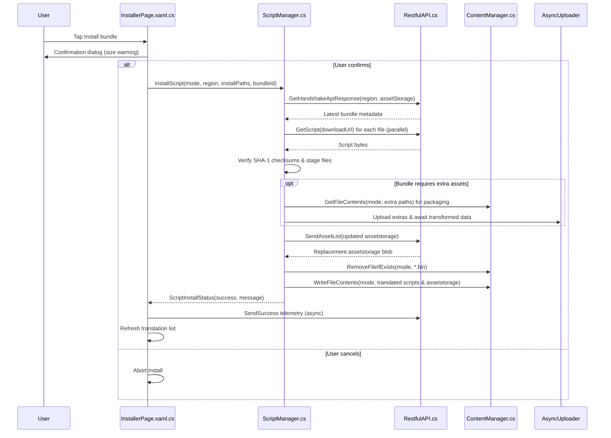
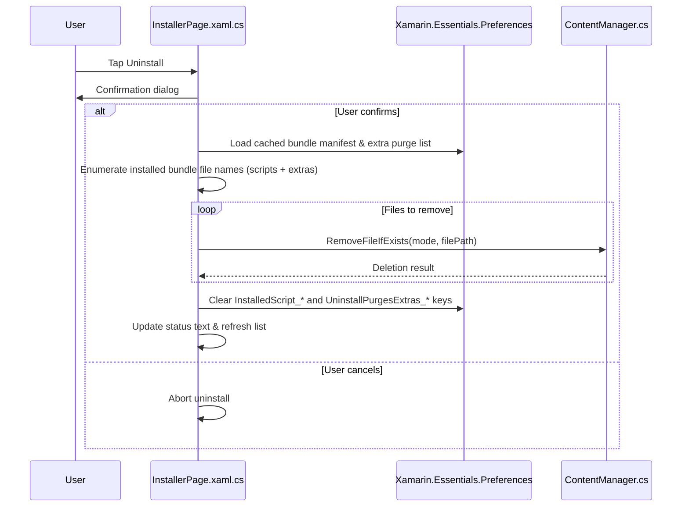

# TranslateFGO Installer Mechanics Recon

## License Attribution
- The repository distributes the application under the MIT License and requires retention of the copyright notice and permission statement in derivative works (`LICENCE.txt`).
- The README reiterates the MIT license for the app and clarifies that bundle creation, translation, and API code are private while the installer is open source (`README.md`).

## Core Components Overview
- `RayshiftTranslateFGO/Views/InstallerPage.xaml.cs` drives the translation installer UI, decides filesystem mode, loads bundles via API handshakes, and orchestrates install/update/uninstall actions.
- `RayshiftTranslateFGO.Android/Services/ContentManager.cs` implements filesystem access for direct storage, Storage Access Framework (SAF), and Shizuku/NextGenFS, including file read/write/delete helpers and discovery of installed game directories.
- `RayshiftTranslateFGO.Android/Services/ScriptManager.cs` encapsulates script installation logic: refreshing handshakes, downloading bundles, validating hashes, updating `assetstorage.txt`, and writing/removing files through `ContentManager`.
- `RayshiftTranslateFGO/Services/RestfulAPI.cs` provides API clients for handshake, bundle download, asset list updates, and telemetry callbacks.
- `RayshiftTranslateFGO.Android/Services/IntentService.cs` manages SAF intents, MediaProjection prompts, and Shizuku binding/permission flows that gate certain filesystem operations.
- `RayshiftTranslateFGO/Util/AppNames.cs` defines the package names checked when scanning external storage for FGO data folders, ensuring the installer only touches recognized JP client directories.

## Sequence Diagrams

### Filesystem Mode Selection

### Update (Translation List Refresh)

### Installation Flow

### Uninstallation Flow

## Data Location Detection
- Direct access enumerates each external storage root, walks parent directories, and collects folders whose final segment matches `AppNames.ValidAppNames` (`RayshiftTranslateFGO.Android/Services/ContentManager.cs`).
- SAF mode uses persisted tree URIs gathered during onboarding to query child folders via `DocumentFile` APIs before matching valid package names (`RayshiftTranslateFGO.Android/Services/ContentManager.cs`).
- Shizuku mode lists directories using `NextGenFSServiceConnection` bindings for elevated access, falling back to manual path probes when necessary (`RayshiftTranslateFGO.Android/Services/ContentManager.cs`, `RayshiftTranslateFGO.Android/NextGenFSServiceConnection.cs`, `RayshiftTranslateFGO.Android/MainActivity.cs`).
- Initial onboarding screens leverage process lists to suggest package identifiers and collect SAF permissions (`RayshiftTranslateFGO/Views/PreInitializePage.xaml.cs`).

## Error & Update Handling
- Asset status warnings triggered by the handshake (e.g., missing, out-of-date, corrupt) result in user-facing alerts before any installation occurs (`RayshiftTranslateFGO/Views/InstallerPage.xaml.cs`).
- Install exceptions such as permission errors, checksum mismatches, or missing extra assets short-circuit the flow with descriptive error strings propagated back to the UI (`RayshiftTranslateFGO.Android/Services/ScriptManager.cs`).
- `ContentManager` centralizes error handling for SAF and Shizuku operations, surfacing status codes that drive retry prompts or onboarding redirects (`RayshiftTranslateFGO.Android/Services/ContentManager.cs`).
