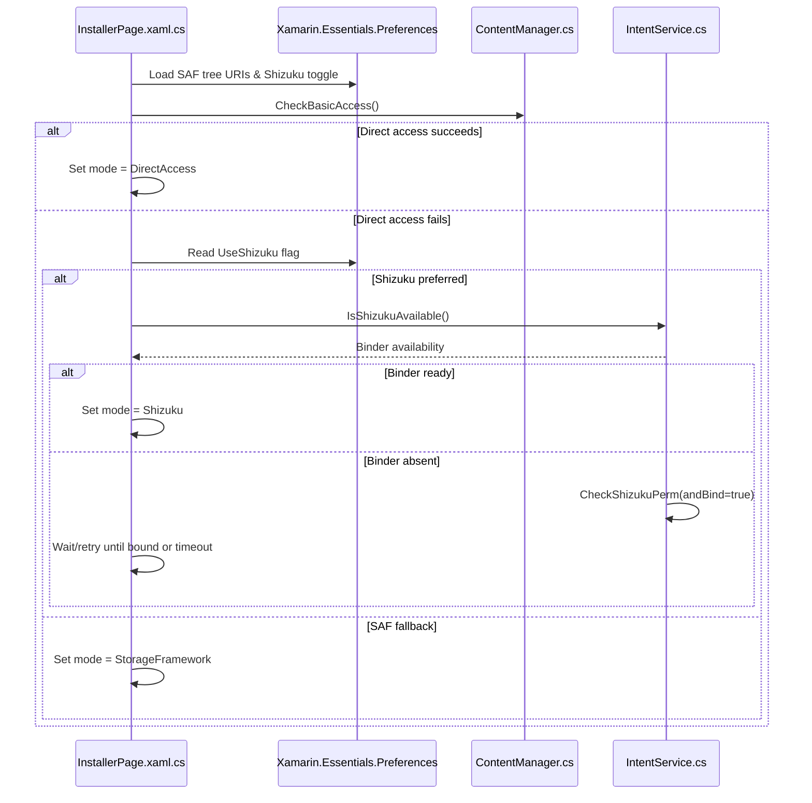
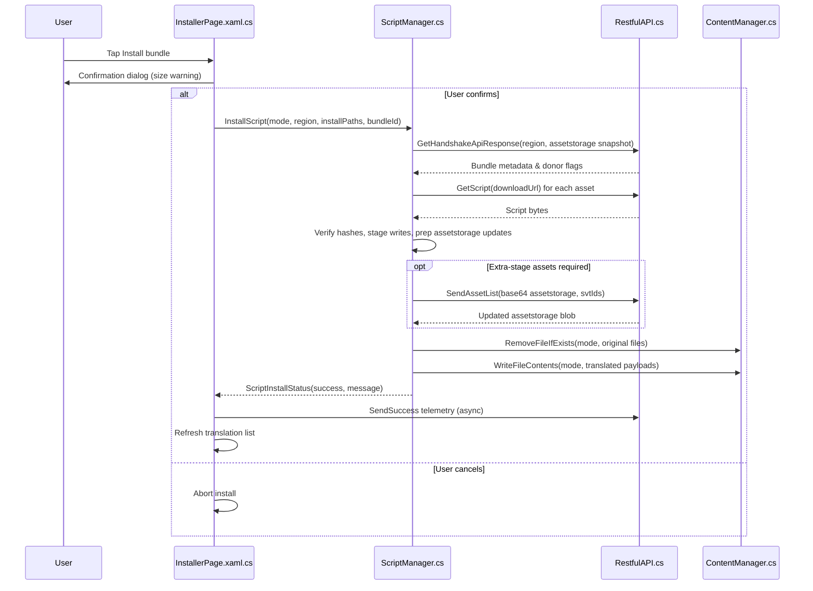
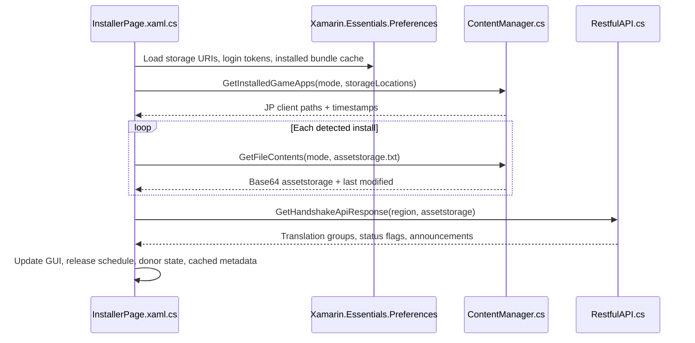

# TranslateFGO Installer Mechanics Recon

## License Attribution
- The repository distributes the application under the MIT License and requires retention of the copyright notice and permission statement in derivative works (`LICENCE.txt`).
- The README reiterates the MIT licensing for the installer code and clarifies that bundle creation, translation, and API services remain private while the public app only handles installation (`README.md`).

## Code Location Map
| Concern | Primary Files |
| --- | --- |
| Installer UI orchestration, handshake workflow, and bundle status rendering | `RayshiftTranslateFGO/Views/InstallerPage.xaml.cs`
| Filesystem access for Direct, SAF, and Shizuku modes plus game discovery helpers | `RayshiftTranslateFGO.Android/Services/ContentManager.cs`
| Script download, checksum verification, assetstorage maintenance, and file writes | `RayshiftTranslateFGO.Android/Services/ScriptManager.cs`
| REST client used for handshake metadata, file downloads, telemetry, and asset list refresh | `RayshiftTranslateFGO/Services/RestfulAPI.cs`
| SAF/Shizuku permission prompts, binder binding, and system intent helpers | `RayshiftTranslateFGO.Android/Services/IntentService.cs`
| Shizuku NextGenFS bindings for privileged filesystem operations | `RayshiftTranslateFGO.NextGenFS/Additions/NextGenFS.cs`
| Onboarding that captures SAF tree URIs, Shizuku opt-in, and caches storage metadata | `RayshiftTranslateFGO/Views/PreInitializePage.xaml.cs`
| Background auto-update worker that reuses install routines | `RayshiftTranslateFGO.Android/RayshiftTranslationUpdateWorker.cs`
| Valid JP client identifiers used during storage scanning | `RayshiftTranslateFGO/Util/AppNames.cs`

## Data Location Detection & Permissions
- During onboarding, the pre-initialization flow triggers SAF tree pickers or Shizuku permission requests, then persists selected document URIs and flags via `Preferences` for later use (`RayshiftTranslateFGO/Views/PreInitializePage.xaml.cs`, `RayshiftTranslateFGO.Android/Services/IntentService.cs`).
- When the installer view refreshes, it reloads cached storage URIs and Shizuku toggles from `Preferences`, clears cached directory metadata, and determines the active filesystem mode by probing direct access first and falling back to user-selected Shizuku or SAF modes (`RayshiftTranslateFGO/Views/InstallerPage.xaml.cs`, `RayshiftTranslateFGO.Android/Services/ContentManager.cs`).
- Game discovery enumerates each accessible root depending on the mode: direct filesystem scanning walks `Android/data` subdirectories, SAF mode queries `DocumentFile` children, and Shizuku mode lists directories through NextGenFS binder calls; each candidate is validated against the known JP package list before being recorded as an install target (`RayshiftTranslateFGO.Android/Services/ContentManager.cs`, `RayshiftTranslateFGO/Util/AppNames.cs`).
- Asset availability checks fetch `assetstorage.txt` via the selected mode and capture timestamps to choose the freshest install path; permission failures trigger onboarding redirects or Shizuku setup messaging within the installer view (`RayshiftTranslateFGO/Views/InstallerPage.xaml.cs`, `RayshiftTranslateFGO.Android/Services/ContentManager.cs`).

## Sequence Diagrams

### Filesystem Mode Selection

### Installation Flow

### Uninstallation Flow

### Update Flow

## Update & Error Handling
- The installer surfaces handshake asset status warnings (missing, update required, time-traveler, corrupt) before allowing installs, matching the README guidance on keeping the game patched (`RayshiftTranslateFGO/Views/InstallerPage.xaml.cs`, `README.md`).
- Automatic updates reuse the script manager to reinstall the last known bundle when background workers trigger, falling back to telemetry logging if failures occur (`RayshiftTranslateFGO.Android/RayshiftTranslationUpdateWorker.cs`).
- Permissions or checksum failures raise descriptive alerts, optionally redirecting users back to storage setup or Shizuku onboarding when `ContentManager` encounters blocked paths (`RayshiftTranslateFGO/Views/InstallerPage.xaml.cs`, `RayshiftTranslateFGO.Android/Services/ContentManager.cs`).
- User-facing troubleshooting advice encourages switching filesystem modes (SAF vs Shizuku), reinstalling, or verifying connectivity, aligning with the README’s support section (`README.md`).
