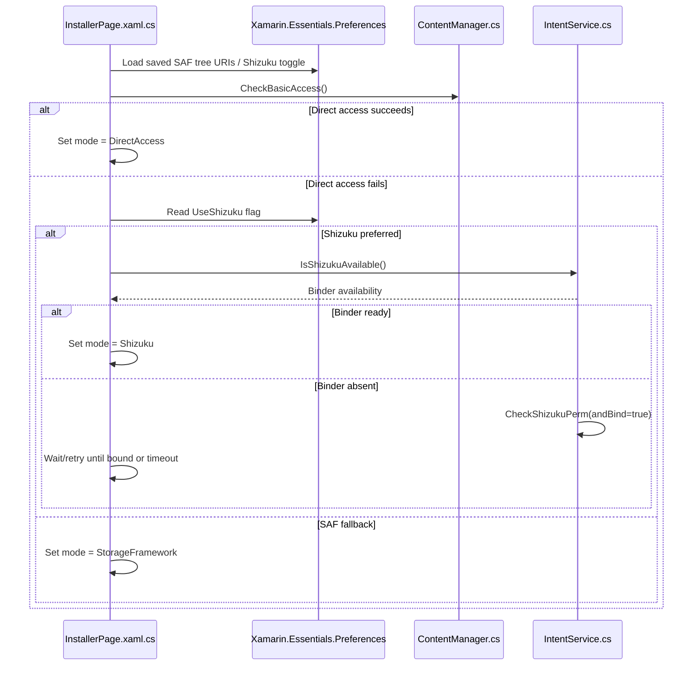
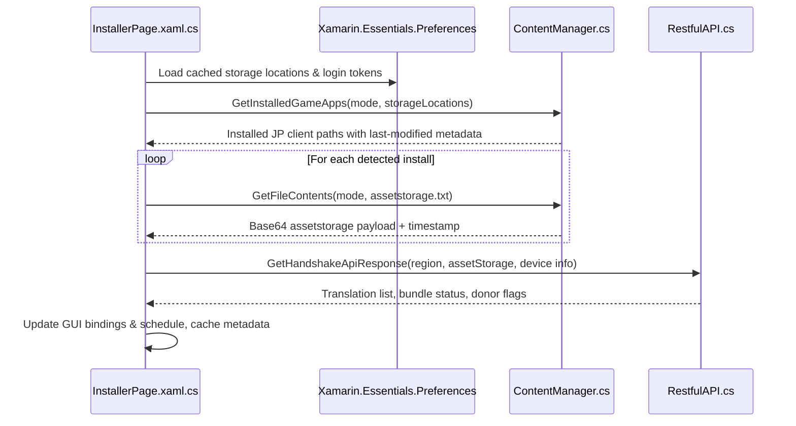
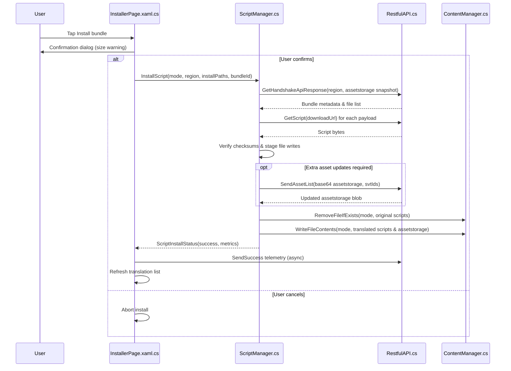
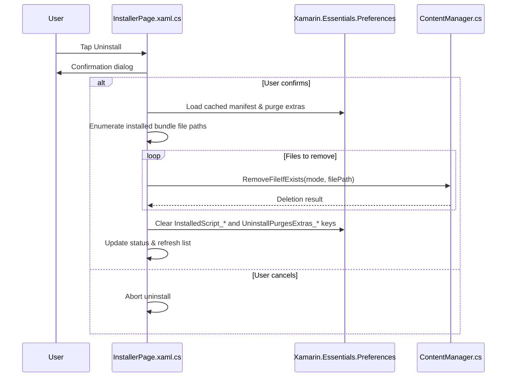

# TranslateFGO Installer Mechanics Recon

## License Attribution
- The repository distributes the application under the MIT License and requires retention of the copyright notice and permission statement in derivative works (`LICENCE.txt`).
- The README reiterates the MIT license for the app and clarifies that bundle creation, translation, and API code are private while the installer is open source (`README.md`).

## Core Components Overview
- `RayshiftTranslateFGO/Views/InstallerPage.xaml.cs` drives the translation installer UI, negotiates filesystem mode, performs handshake requests, and orchestrates install/update/uninstall actions.
- `RayshiftTranslateFGO.Android/Services/ContentManager.cs` implements filesystem access strategies for direct storage, Storage Access Framework (SAF), and Shizuku/NextGenFS, including file discovery, read/write/delete helpers, and detection of installed game directories.
- `RayshiftTranslateFGO.Android/Services/ScriptManager.cs` encapsulates bundle installation logic: refreshing handshakes, downloading archives, validating checksums, updating `assetstorage.txt`, and writing or removing files via `ContentManager`.
- `RayshiftTranslateFGO/Services/RestfulAPI.cs` provides the network API client used for handshake metadata, bundle downloads, asset list refreshes, and telemetry callbacks.
- `RayshiftTranslateFGO.Android/Services/IntentService.cs` manages SAF intents, MediaProjection/storage prompts, and Shizuku binding/permission flows that gate filesystem operations.
- `RayshiftTranslateFGO/Util/AppNames.cs` defines valid package identifiers used when scanning storage to ensure only known JP client directories are targeted.
- `RayshiftTranslateFGO/Views/PreInitializePage.xaml.cs` and related onboarding views collect SAF permissions, Shizuku opt-ins, and cached storage URIs before the installer runs.

## Sequence Diagrams

### Filesystem Mode Selection

### Update (Translation List Refresh)

### Installation Flow

### Uninstallation Flow

## Data Location Detection & Permissions
- Direct filesystem mode enumerates each external storage root, walks parent directories, and collects folders whose final segment matches `AppNames.ValidAppNames` (`RayshiftTranslateFGO.Android/Services/ContentManager.cs`).
- SAF mode stores tree URIs collected during onboarding and queries `DocumentFile` children before matching against valid package names; missing permissions trigger prompts via `IntentService` (`RayshiftTranslateFGO.Android/Services/ContentManager.cs`, `RayshiftTranslateFGO.Android/Services/IntentService.cs`).
- Shizuku mode lists directories using NextGenFS bindings exposed by the Android project and requires binder permission checks plus listener setup (`RayshiftTranslateFGO.Android/Services/ContentManager.cs`, `RayshiftTranslateFGO.Android/Services/IntentService.cs`, `RayshiftTranslateFGO.Android/MainActivity.cs`).
- Onboarding pages (`RayshiftTranslateFGO/Views/PreInitializePage.xaml.cs`) prompt the user to choose SAF locations, enable Shizuku if desired, and persist selections for installer use.

## Update & Error Handling
- Asset status flags returned during the handshake (missing, out-of-date, donor-locked) gate installation actions and trigger user-visible warnings before proceeding (`RayshiftTranslateFGO/Views/InstallerPage.xaml.cs`).
- Installation failures such as permission errors, checksum mismatches, or API failures short-circuit with descriptive error strings propagated back to the UI (`RayshiftTranslateFGO.Android/Services/ScriptManager.cs`).
- `ContentManager` centralizes filesystem error handling for all access modes and surfaces status codes that drive retry prompts or onboarding redirects (`RayshiftTranslateFGO.Android/Services/ContentManager.cs`).
- The README documents user-facing troubleshooting guidance for storage errors (e.g., switching between SAF and Shizuku) and outlines update expectations (`README.md`).
